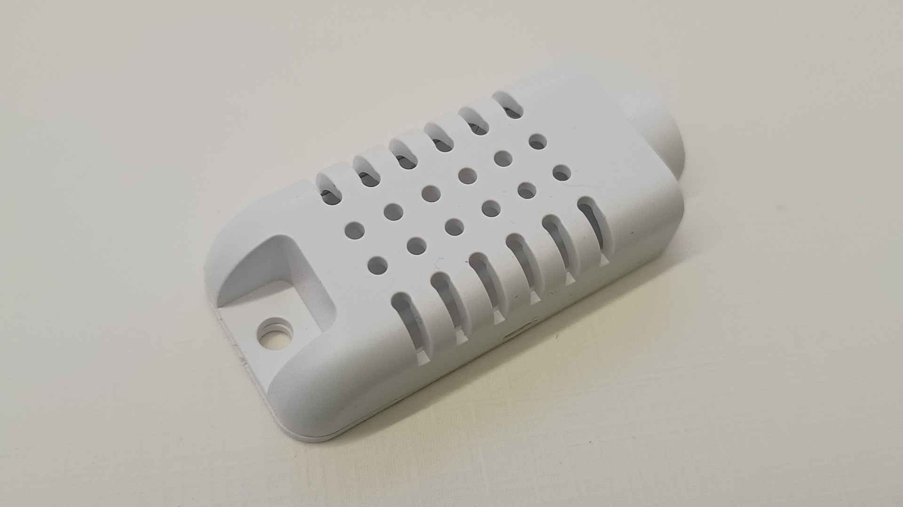
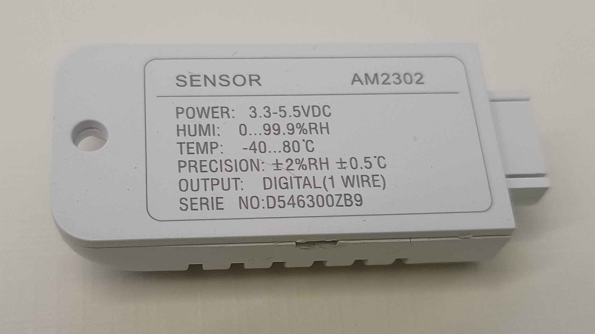
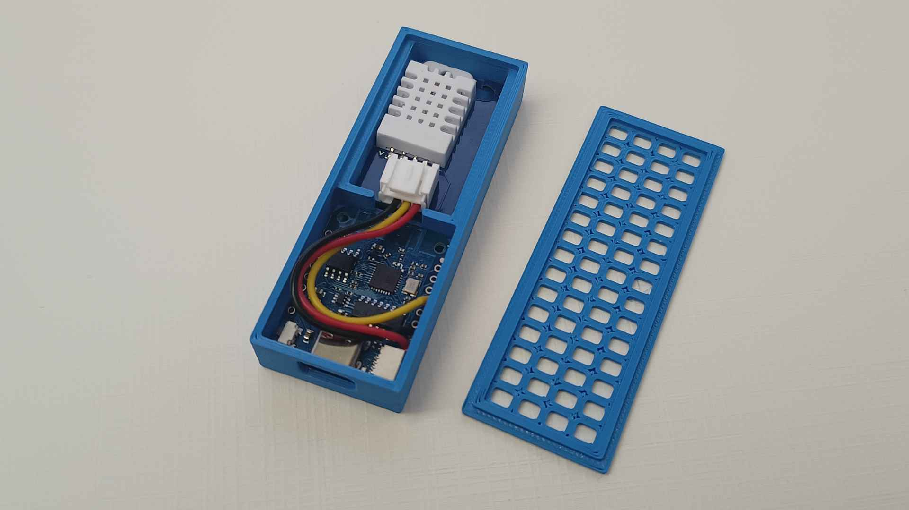
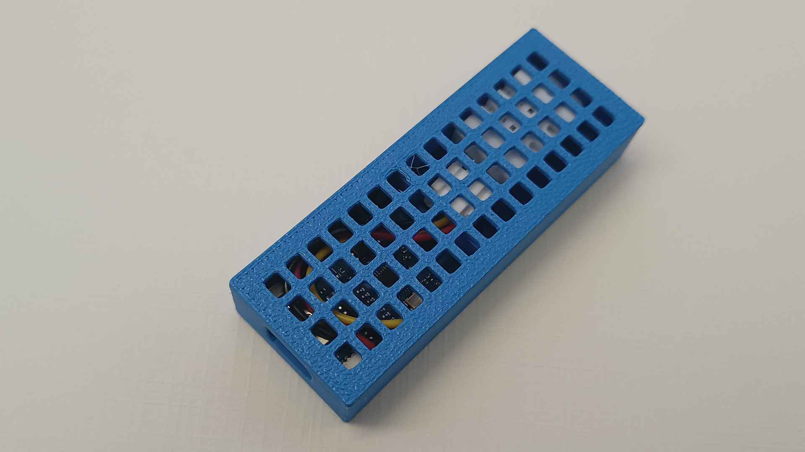
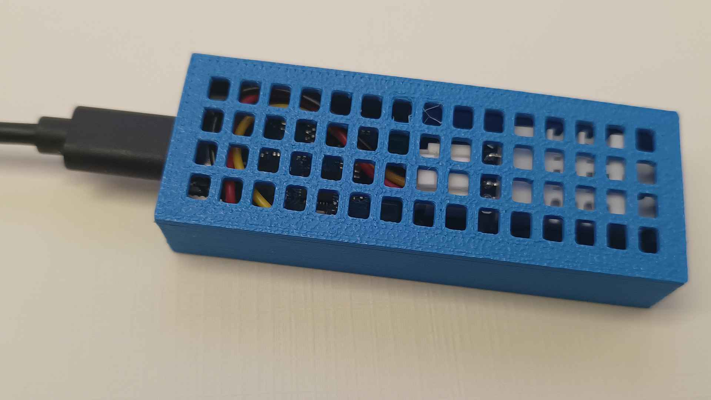

# Case for Wemos D1 Mini with DHT22/AM2302

This is case for Wemos D1 mini with DHT22/AM2302 sensor. My sensor came in this case and I originally intended to use it as is:

But the D1 mini is exactly the same width as the entire casing, so I pried it open and rehoused the board into new one I designed.

The OpenSCAD model is parametric and can be easily used for basically any sensor board.