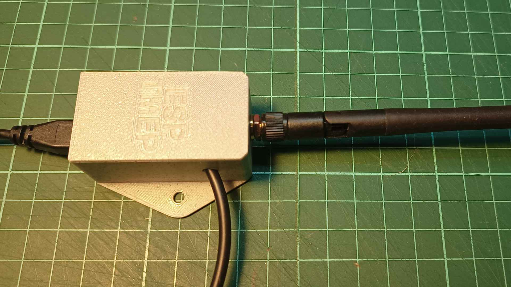
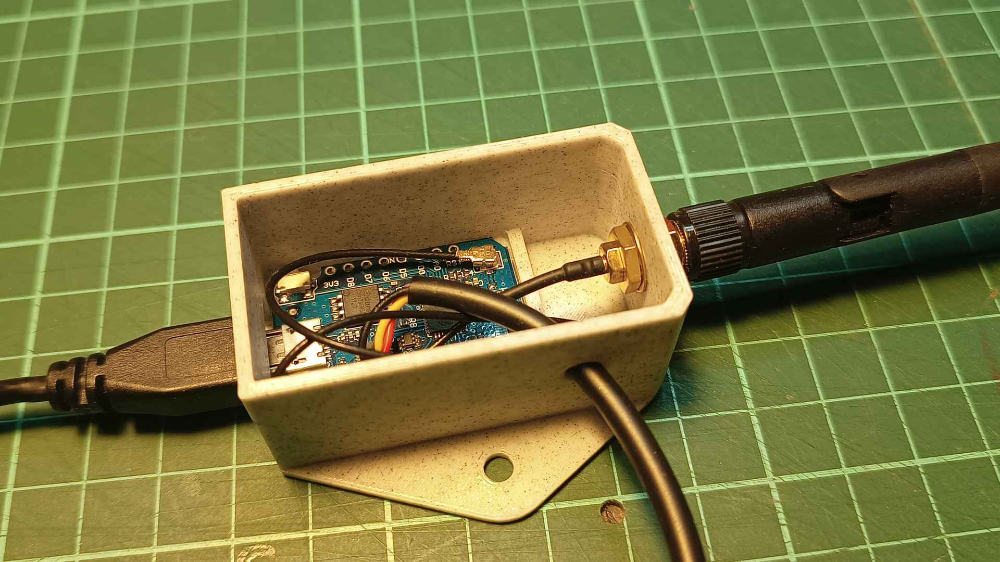

# Square case for D1 mini with external antenna

This is another case for ESP-TMEP in D1 Mini and sensor with cable. It's not as elegant as the round one, but it is compatible with boards with external antennas, which was the main board.

This model is heavily modified but based on [**Wemos D1 mini box**](http://www.thingiverse.com/thing:1995963) by **matsekberg** on Thingiverse.

