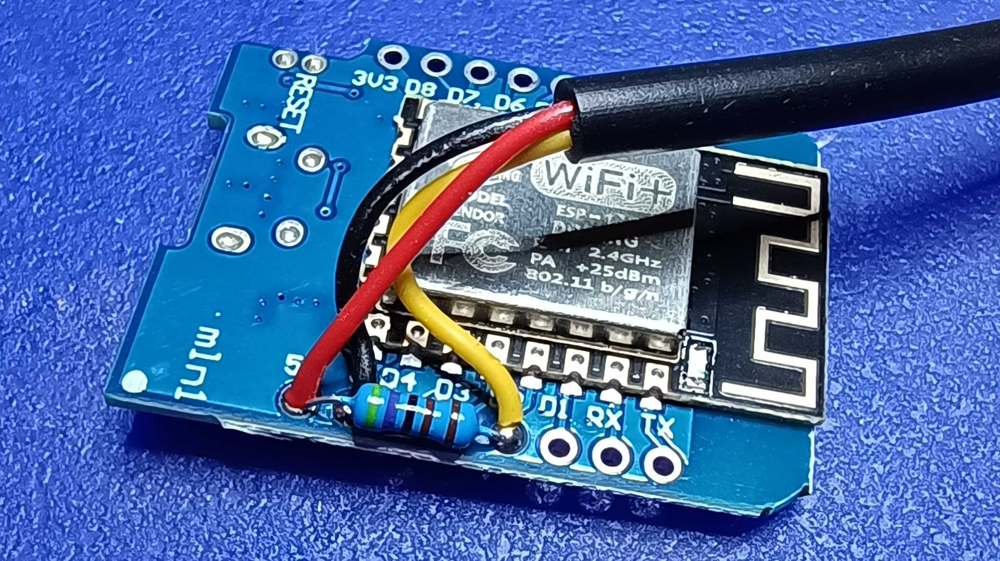
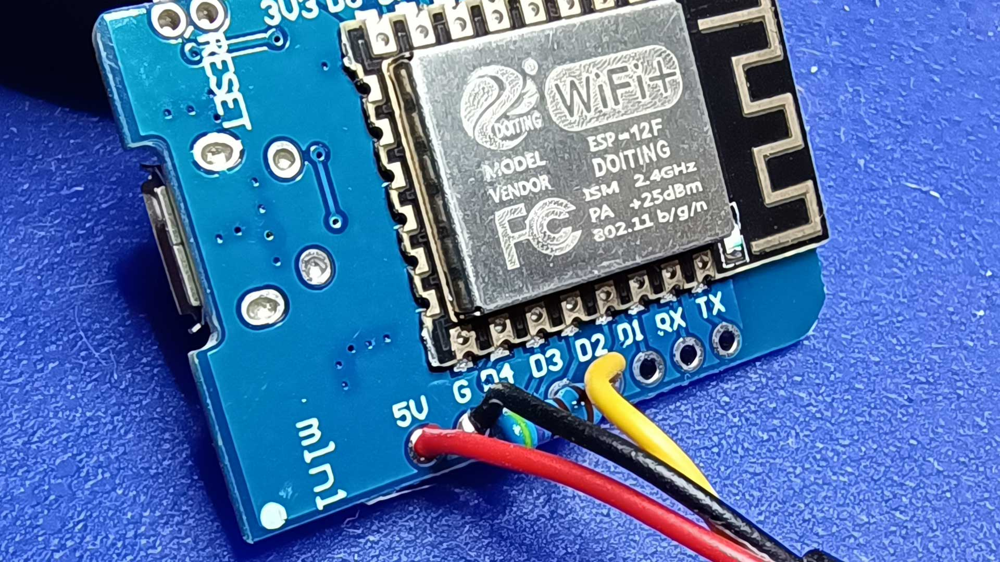
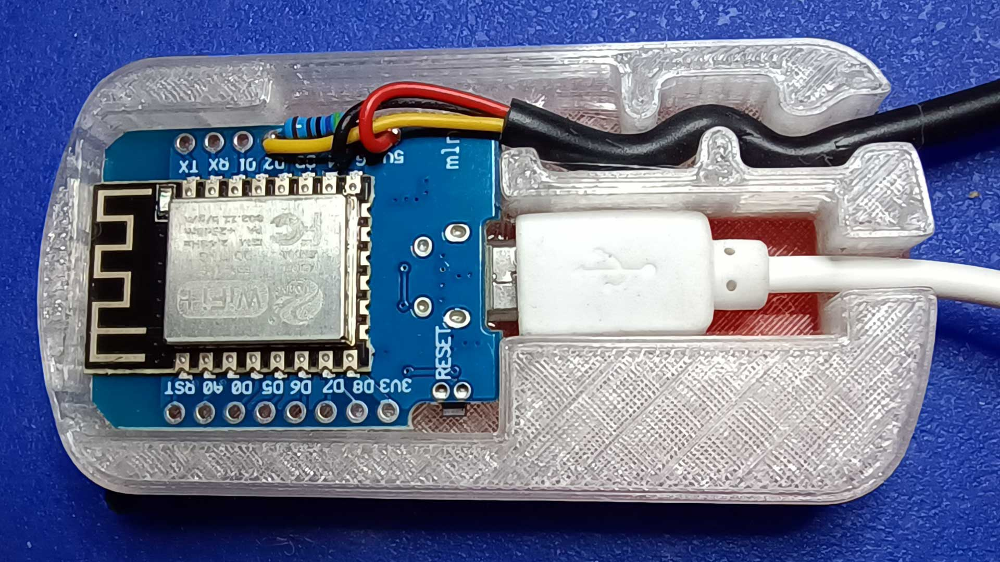
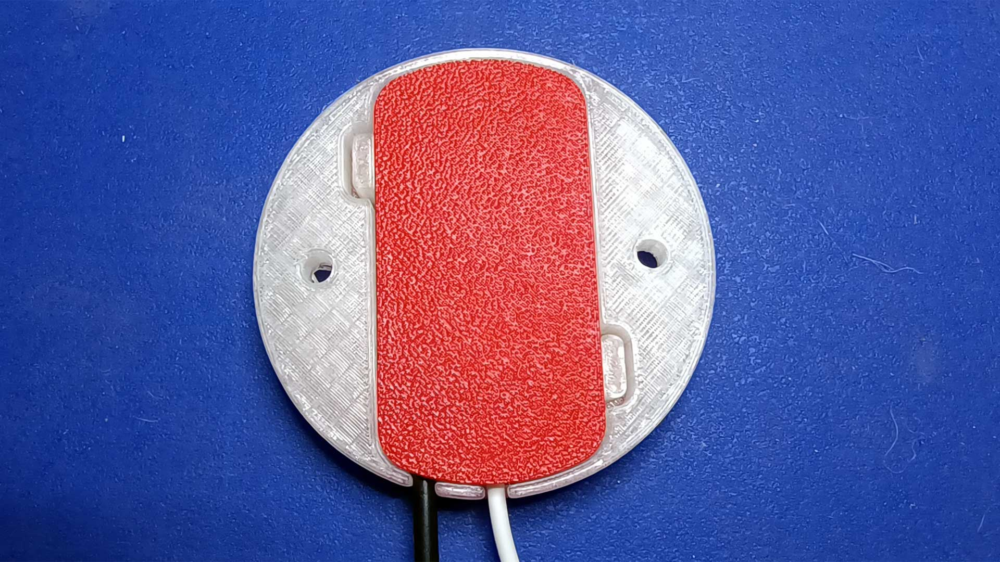
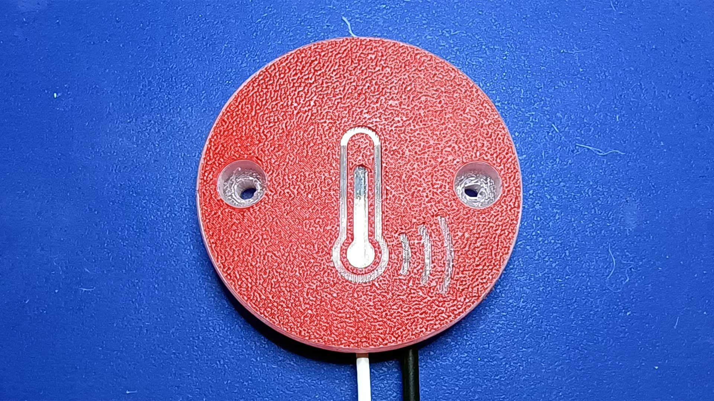

# ESP-TMEP

ESP-TMEP is firmware for ESP8266, which can measure temperature using DS18B20 and send it to the [TMEP.CZ](https://www.tmep.cz/) online service or any other service that accepts HTTP GET requests.

> Build video and basic information about this project (in Czech) is [on my blog](https://www.altair.blog/2022/09/esp-tmep) and the Z-TECH YouTube channel:

* [Jak vyrobit Internetový teploměr pro TMEP.CZ ze třech součástek](https://www.youtube.com/watch?v=qh9V8oPX-iM)
* [Vylepšení internetového teploměru ESP-TMEP](https://www.youtube.com/watch?v=5T04NmTo4V4)
* [Aktualizace internetového teploměru ESP-TMEP](https://www.youtube.com/watch?v=DLWacm16rQw)
* [ESP-TMEP: Timeout konfigurace a průměrování hodnot](https://www.youtube.com/watch?v=3yfG-qK2-xU)

## Features and limitations

### Features

* Support for common DS18B20 temperature sensors.
* User-friendly deployment (no need to modify code, easy configuration via web browser).
* Can send values to three URLs.
* Reboots every 29 hours to maintain stability.
* Measures temperature as a rolling average over 1 minute to compensate for measuring errors.

### Limitations

* No server certificate validation is performed, because on ESP8266 it's practically impossible.
* Internal web server is HTTP only; again, because proper HTTPS is almost impossible on ESP8266.
* Some parameters are still hardcoded:
    * Interval in which data are measured and sent (always 60 seconds).
    * Remote server protocol (always uses HTTPS).
    * Remote server timeout.

## Usage

### Configuration mode

After first startup, the device boots into configuration mode. It creates an Wi-Fi access point named `ESP-TMEP-xxxxxxxx` (where `xxxxxxxx` stands for unique chip ID). After connecting, you'll see the configuration UI. In addition to network name and password, you can configure the following options:

Name              | Example        | Size | Description
----------------- | -------------- | ---: | ------------------------------------
Remote host name  | `demo.tmep.cz` | 100  | Host name part of the target URI
Remote host path  | `/?temp=`      | 100  | Path part of the target URI
Configuration PIN | `AbXy1234`     | 20   | PIN/password for configuration reset

The target URI is constructed by joining the parameters and measured value in °C:

Scheme     | Host           | Path      | Value
---------- | -------------- | --------- | ------
`https://` | `demo.tmep.cz` | `/?temp=` | `22.63`

You can define up to three URLs.

### Operational mode

Device then restarts to operational mode. In this mode, in addition to sending the measurement to remote servers, runs a local web server, offering the following services:

URI              | Description
---------------- | ------------------------------------
`/`              | Homepage showing current temperature
`/api`           | JSON API endpoint
`/reset?pin=XXX` | Switch to configuration mode

### JSON API

The response has the following format:

```json
{
    "temp" : 22.63,
    "deviceId" : "ESP-TMEP-xxxxxxxx",
    "version" : "2.2.0"
}
```

* `temp` is last measured temperature in °C
* `deviceId` is unique device identifier (`xxxxxxxx` is chip ID)
* `version` is firmware version

### LED status

Device status is indicated by the builtin LED. There is a number of 250 ms flashes rougly once per second:

Flashes       | Meaning
------------- | -----------------------------------
1             | Normal operation
2             | Sensor error
3             | Remote server connection error
4             | Remote server connection timeout
permanent on  | Wi-Fi connecting or config required
fast blinking | Internal error in SPIFFS

## Hardware

Any board with ESP8266 chip can be used. I'm using LOLIN/Wemos D1 mini.

Hardware connections (the _wire color_ column refers to common wire colors of the waterproofed version of DS18B20):

D1 Mini | DS18B20 | Wire color
------- | ------- | ----------
G       | GND     | black
5V      | VDD     | red
D2      | DQ      | yellow

Additionally connect 4k7 resistor between VDD/5V and DQ/D2.





## Case

I'm using this [WeMos D1 mini Enclosure](https://www.printables.com/model/44083-wemos-d1-mini-enclosure) by [100prznt](https://www.printables.com/social/23641-100prznt/about).







## Software

This firmware is using [ESP8266 Arduino Core 3.1.2](https://github.com/esp8266/Arduino). The following external libraries are required:

* [ArduinoJson](https://arduinojson.org/) (tested with version 7.0.2)
* [DallasTemperature](https://github.com/milesburton/Arduino-Temperature-Control-Library) (tested with version 3.9.0)
* [OneWire](https://www.pjrc.com/teensy/td_libs_OneWire.html) (tested with version 2.3.7)
* [WiFiManager](https://github.com/tzapu/WiFiManager) (tested with version 2.0.16-rc2)