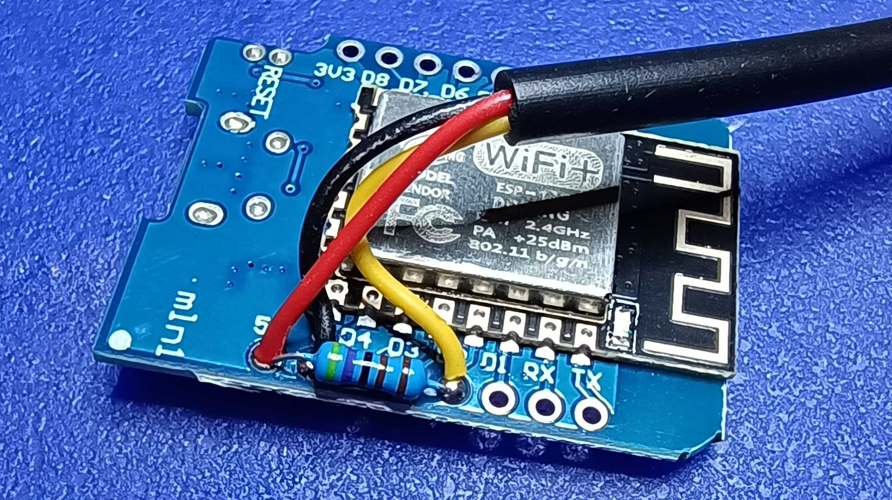

# ESP-TMEP

ESP-TMEP is firmware for ESP8266, which can measure environmental values (temperature, humidity and atmospheric pressure) and send it to the [TMEP.CZ](https://www.tmep.cz/) online service or any other service that accepts compatible HTTP GET requests.

> Build video and basic information about this project (in Czech) is [on my blog](https://www.altair.blog/2022/09/esp-tmep) and the Z-TECH YouTube channel:

* [Jak vyrobit Internetový teploměr pro TMEP.CZ ze třech součástek](https://www.youtube.com/watch?v=qh9V8oPX-iM)
* [Vylepšení internetového teploměru ESP-TMEP](https://www.youtube.com/watch?v=5T04NmTo4V4)
* [Aktualizace internetového teploměru ESP-TMEP](https://www.youtube.com/watch?v=DLWacm16rQw)
* [ESP-TMEP: Timeout konfigurace a průměrování hodnot](https://www.youtube.com/watch?v=3yfG-qK2-xU)

## Features and limitations

### Features

* Support for common temperature sensors:
    * DS18B20 (temperature only)
    * DHT22 (temperature and humidity)
    * Extensible for any temperature, humidity and pressure sensors
* User-friendly deployment (no need to modify code, easy configuration via web browser).
* Can send values to three URLs.
* Reboots every 29 hours to maintain stability.
* Measures temperature as a rolling average over 1 minute to compensate for measuring errors.

### Limitations

* No server certificate validation is performed, because on ESP8266 it's practically impossible to do it right.
* Internal web server is HTTP only; again, because proper HTTPS is almost impossible on ESP8266.
* Some parameters are still hardcoded:
    * Interval in which data are measured and sent (always 60 seconds).
    * Remote server protocol (always uses HTTPS).
    * Remote server timeout.

## Usage

### Configuration mode

After first startup, the device boots into configuration mode. It creates an Wi-Fi access point named `ESP-TMEP-xxxxxxxx` (where `xxxxxxxx` stands for unique chip ID). After connecting, you'll see the configuration UI. In addition to network name and password, you can configure the following options:

Name              | Example        | Size | Description
----------------- | -------------- | ---: | ------------------------------------
Remote host name  | `demo.tmep.cz` | 100  | Host name part of the target URI
Configuration PIN | `AbXy1234`     | 20   | PIN/password for configuration reset

The target URI is constructed by adding the following query string parameters:

* `temp` - temperature in °C
* `rssi` - Wi-Fi signal strength in dBm
* `humi` - humidity in % RH (when supported by sensor)
* `pres` - atmospheric pressure in hpa (when supported by sensor)

Examples:

* `https://demo.tmep.cz/?temp=12.34&rssi=-47`
* `https://demo.tmep.cz/?temp=12.34&rssi=-47&humi=51.32`

You can define up to three URLs.

### Operational mode

Device then restarts to operational mode. In this mode, in addition to sending the measurement to remote servers, runs a local web server, offering the following services:

URI              | Description
---------------- | -------------------------------
`/`              | Homepage showing current values
`/api`           | JSON API endpoint
`/reset?pin=XXX` | Switch to configuration mode

### JSON API

The response has the following format:

```json
{
    "temp" : 22.63,
    "rssi": -47,
    "humi": 55.13,
    "sensorType" : "DS18B20",
    "deviceId" : "ESP-TMEP-xxxxxxxx",
    "version" : "3.0.0"
}
```

* `temp` - temperature in °C.
* `rssi` - Wi-Fi signal strength in dBm.
* `humi` - humidity in % RH (when supported by sensor).
* `pres` - atmospheric pressure in hpa (when supported by sensor).
* `sensorType` - string identifying the sensor type. Currently either `DS18B20` or `DHT22`.
* `deviceId` - unique device ID, based on ESP chip ID.
* `version` - firmware version.

### LED status

Device status is indicated by the builtin LED. There is a number of 250 ms flashes rougly once per second:

Flashes       | Meaning
------------- | -----------------------------------
1             | Normal operation
2             | Sensor error
3             | Remote server connection error
4             | Remote server connection timeout
permanent on  | Wi-Fi connecting or config required
fast blinking | Internal error in SPIFFS

## Hardware

Any board with ESP8266 chip can be used. I'm using LOLIN/Wemos D1 Mini. As a sensor you can use either DS18B20 or DHT22/AM2302.

Hardware connections (the _wire color_ column refers to common wire colors on sensor cables):

D1 Mini             | Sensor  | Wire color
------------------- | ------- | ----------
**G** or **GND**    | **GND** | black
**5V** or **VBUS**  | **VDD** | red
**D2** or **4/SDA** | **DQ**  | yellow

### Using DS18B20 temperature sensor

Connect as indicated above, additionally connect 4k7 resistor between VDD/5V and DQ/D2.




Use the `DS18B20` profile in PlatformIO or `#define SENSOR_DS18B20` manually.

### Using DHT22/AM2302 temperature and humidity sensor

Connect as indicated above. Then use `DHT22` profile in PlatformIO or `#define SENSOR_DHT22`.

### Other sensor types

It's fairly easy to add support for other sensor types:

First create new profile in `platformio.ini`, where you import the appropriate library and define `SENSOR_XXX` directive.

Then modify `main.cpp` using the `#ifdef` directives to:
1. Initialize the sensor if/as required in `setup()`.
2. Define `SUPPORT_HUMIDITY` and `SUPPORT_PRESSURE`, if the sensor supports measuring them.
3. Create `measureValues()` for your sensor. Look into existing implementations for how to compute the rolling average.
4. Modify `handleApi()` to return appropriate `sensorType` value via API.

Heavier modification is needed if the sensor requires more than one GPIO pin to communicate.

I'm generally willing to add support for other sensor types to the source code if you send me one example of the sensor and there is library for communication with it.

## Software

This firmware is built using PlatformIO IDE and the [ESP8266 Arduino Core](https://github.com/esp8266/Arduino). See [`platformio.ini`](ESP-TMEP/platformio.ini) for dependencies. 

## Case

All cases are for the Wemos D1 Mini board.

* [Round](Round) - pretty round case for sensors with cable.
* [Square-antenna](Square-antenna) - simple case for sensors with cable and hole for external antenna connector.
* [Square-DHT](Square-DHT) - simple case for board-bases sensors, such as DHT22.